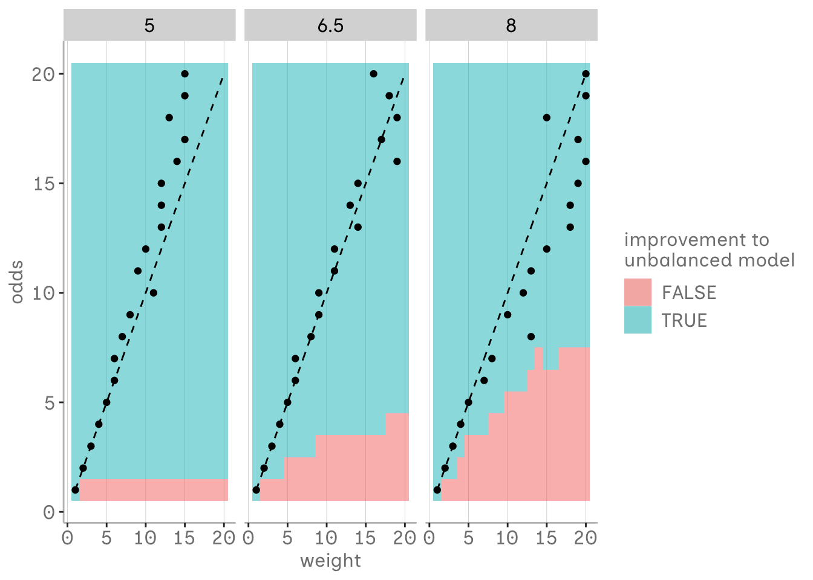

::: {.cell}

:::


In Logistic Regression, we estimate a linear model for the log odds of observing an event across different levels of our predictor. These log odds can be transformed into probabilities, which then create the characteristic S-curve.

At the core, it all boils down to odds. Having odds of 1:1 in our underlying data generating process means both events are generally equally likely to occur, each with a probability of 50%.
Our fictional population for the simulation follows this setup, where the probabilities of our events are dependent on values drawn from normal distributions for both groups, each with a mean of 5 and 8 and a standard deviation of 1.


::: {.cell}

```{.r .cell-code}
library(tidyverse)

    a <- tibble(value = rnorm(4000, 5, 1), condition = "a")
    b <- tibble(value = rnorm(4000, 8, 1), condition = "b")
    df_ab <- bind_rows(a, b)

df_ab %>%
  ggplot(aes(x = value, y = condition, fill = condition))+
  ggdist::stat_halfeye()+ 
  scale_x_continuous(breaks = seq(1,12,1))+
  blog_theme()+
  guides(fill = "none")
```

::: {.cell-output-display}
{width=672}
:::
:::


## simulating imbalance

To get an idea on how sample weights effect the logistic regression outcomes, we generate some simulations from our fictional population under different conditions. Each sample will consist of 400 samples with N = 400 drawing from our population.

1. **Balanced Dataset:** Each sample will have a 1:1 ratio of our two classes.

2. **Unbalanced Dataset:** Each sample will have a 1:4 ratio, representing a class imbalance.

3. **Weighted Unbalanced Dataset:** Similar to the unbalanced dataset, but here each sample in the minority class will be assigned a weight of 4 to counteract the imbalance.

For each sample under these conditions, we will perform a logistic regression using the `logistic_sim` function on each sample.

Afterwards we will compute the median of the estimated parameters (e.g., coefficients and intercepts) from each condition to get a robust measure of central tendency, less affected by outliers than the mean. 

Finally, we will aggregate these median parameter estimates across all conditions into a single logistic regression model for each condition. 

::: {.panel-tabset}

## logistic_sim function 


::: {.cell}

```{.r .cell-code}
logistic_sim <- function(sample_n, a_n, b_n, a_mean = 5, b_mean = 8, a_std = 1, b_std = 1, weight = 1){
  map(1:sample_n, ~ {
    # Create samples for conditions a and b
    a <- tibble(value = rnorm(a_n, a_mean, a_std), condition = 0)
    b <- tibble(value = rnorm(b_n, b_mean, b_std), condition = 1)
    df_ab <- bind_rows(a, b)

    # Adjust weights if the argument is given and not 1 
    if (weight != 1){
      df_ab <- df_ab %>%
        mutate(weights = ifelse(condition == 0, weight, 1))
    }

    return(df_ab)
  }) %>%
  imap(~ {
    if (weight != 1) {
      # Fit model with weights
      model <- glm(condition ~ value, family = binomial, data = .x, weights = .x$weights)
    } else {
      # Fit model without weights
      model <- glm(condition ~ value, family = binomial, data = .x)
    }
    # Tidy and return the model coefficients with iteration number
    broom::tidy(model) %>%
      select(term, estimate) %>%
      mutate(iteration = .y)
  }) %>%
  bind_rows() %>%
  pivot_wider(names_from = term, values_from = estimate) %>%
  rename(alpha = `(Intercept)`, beta = value)
}
```
:::


## conditions 


::: {.cell}

```{.r .cell-code}
doParallel::registerDoParallel(cores = parallel::detectCores())

balanced_estimates <- logistic_sim(400, a_n = 200, b_n = 200) %>%
  mutate(model = "balanced")
unbalanced_estimates <- logistic_sim(400, a_n = 67, b_n = 333) %>%
  mutate(model = "unbalanced")
weighted_estimates <- logistic_sim(400, a_n = 67, b_n = 333, weight = 4) %>%
  mutate(model = "weighted")
```
:::


:::

As we can see, the estimates from the unbalanced model are quite off compared to those from the balanced one. It appears that the intercept is especially affected, while the slope seems relatively similar, though all estimated probabilities are nonetheless influenced.

The unbalanced model that used weights does not seem too much off. Assuming that our two events are equally likely in our population, but our sample is biased, choosing the right weight might be a solution.


::: {.cell}

```{.r .cell-code}
bind_rows(balanced_estimates, unbalanced_estimates, weighted_estimates) %>%
group_by(model) %>%
summarise(alpha.median = median(alpha),
            beta.median = median(beta)) %>%
  mutate(x = list(seq(3,9,.1))) %>%
  unnest(x) %>%
  mutate(y = boot::inv.logit(alpha.median + beta.median * x)) %>%
  ggplot(aes(x = x, y = y, col = model))+
  geom_line()+
  xlab("value")+
  ylab("probability")+
  blog_theme()
```

::: {.cell-output-display}
{width=672}
:::
:::


## relationship between odds and weights

But how do we determine the appropriate weight to choose?

To explore this, we experiment with all possible combinations of odds and weights ranging from 1 to 20 in our fictional population. We employ the `logistic_sim` function again to estimate our median parameters under each combination.

This approach allows us to systematically assess how different weights influence the logistic regression model’s ability to handle varying levels of class imbalance.


::: {.cell}

```{.r .cell-code}
sample_n = 400
odds = 1:20
a_n = round(sample_n / (odds + 1))
b_n = 400 - a_n
weight = list(1:20)

sim_models <- tibble(sample_n, odds, a_n, b_n, weight) %>%
  unnest(weight)

psych::headTail(sim_models)
```

::: {.cell-output .cell-output-stdout}
```
  sample_n odds a_n b_n weight
1      400    1 200 200      1
2      400    1 200 200      2
3      400    1 200 200      3
4      400    1 200 200      4
5      ...  ... ... ...    ...
6      400   20  19 381     17
7      400   20  19 381     18
8      400   20  19 381     19
9      400   20  19 381     20
```
:::
:::


```{{r}}

doParallel::registerDoParallel(cores = parallel::detectCores())

model_estimates <- sim_models %>%
  mutate(estimates = pmap(list(sample_n = sample_n, a_n = a_n, b_n = b_n, weight = weight), logistic_sim, .progress = TRUE))

```


::: {.cell}

:::


## evaluating parameter estimates for different odds and weights

We assess the performance of each model by examining the median error at different values of our variable of interest—the mean of both groups and the midpoint value between these means. Our findings indicate that the median error tends to decrease up to a certain weight threshold, after which it tends to increase again.


::: {.cell}

```{.r .cell-code}
#| code-fold: true

pred <- model_estimates %>%
  unnest(estimates) %>%
  group_by(odds, a_n, b_n, weight) %>%
  summarise(alpha.median = median(alpha),
            beta.median = median(beta)) %>%
  ungroup() %>%
  mutate(x = list(c(5, 6.5, 8))) %>%
  unnest(x) %>%
  mutate(y = boot::inv.logit(alpha.median + beta.median * x))

bench <- pred %>%
  filter(weight == 1, odds == 1) %>%
  select(x, y_bench = y)

pred_bench <- pred %>%
  left_join(bench, by = join_by(x)) %>%
  mutate(median_error = abs(y_bench - y)) 

pred_min <- pred_bench %>%
  filter(x == 6.5) %>%
  group_by(odds) %>%
  filter(median_error == min(median_error)) %>%
  select(odds, weight)

pred_bench %>%
  # mutate(odds = as.character(paste0("1:",odds))) %>%
  ggplot(aes(x = weight, y = median_error, col = factor(x)))+
  geom_line()+
  facet_wrap(~odds)+
  blog_theme()+
  geom_vline(data = pred_min, aes(xintercept = weight), size = 1, color = "gray", linetype= "dotted")+
  ylab("median error")+
  labs(col = "value")
```

::: {.cell-output-display}
{width=672}
:::
:::


## choosing weights

This threshold seems to be closely related to the odds ratio. Thus, choosing the assumed imbalance of the odds as the weight is particularly beneficial, especially for lower imbalances. However, deviations at higher imbalances may also be due to the uncertainty of estimates as the sample size for the minority group decreases. As the odds increase, the need for precise weight selection becomes less critical compared to using the unbalanced model.

For lower odds, there's a tolerance for selecting an incorrect weight. For example, in our specific simulation, at odds of 1:2, the weight estimate could vary from 2 weights off to 19 off, depending on the predictor value, and still provide more precise estimates than the unweighted model. However, while there seems to be some tolerance, it's important to note that no broad generalizations should be drawn from our simplified simulation.


::: {.cell}

```{.r .cell-code}
no_weight_bench <- pred_bench %>%
  filter(weight == 1) %>%
  select(odds, x, median_error_nw = median_error)

pred_nh <- pred_bench %>%
  left_join(no_weight_bench, by = join_by(odds, x), relationship = "many-to-many") %>%
  mutate(improvement = ifelse(median_error <= median_error_nw, TRUE, FALSE))

pred_min_error <- pred_bench %>%
  group_by(x, odds) %>%
  filter(median_error == min(median_error)) %>%
  select(x, odds, weight) %>%
  mutate(best_weight = weight) %>%
  ungroup()

pred_nh %>%
  left_join(pred_min_error, by = join_by(odds, weight, x)) %>%
  ggplot(aes(x = weight, y = odds))+
  geom_tile(aes(fill = improvement ), alpha = .5)+
  geom_line(aes(x = odds, y = odds), linetype= "dashed")+
  geom_point(aes(x = best_weight, y = odds))+
  facet_wrap(~factor(x))+
  blog_theme()+
  labs(fill = "improvement to\nunbalanced model")
```

::: {.cell-output-display}
{width=672}
:::
:::


## conclusion

Weights are a practical approach to address data imbalances that don't reflect the actual odds in the population. But, it’s important to adjust these weights carefully, based on what we know about the population to get better results. Also, it’s good to recognize that natural class imbalances in your data should be seen as normal features, not issues to be fixed.

Comparing different models, with and without weight adjustments, especially in terms of their predictive accuracy, can be quite helpful. Just keep in mind, our simple simulation doesn’t cover all the bases. So, when you’re doing your research, make sure to take into account the specific factors relevant to your field, as the literature suggests.


