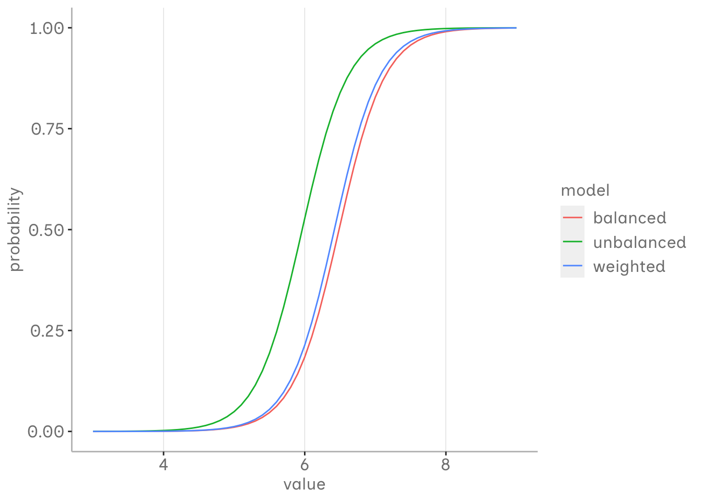

::: {.cell}

:::


In Logistic Regression, we estimate a linear model for the log odds of observing an event across different levels of our predictor. These log odds can be transformed into probabilities, which then create the characteristic S-curve.

At the core, it all boils down to odds. Having odds of 1:1 in our underlying data generating process means both events are generally equally likely to occur, each with a probability of 50%.
Our fictional population for the simulation follows this setup, where the probabilities of our events are dependent on values drawn from normal distributions for both groups, each with a mean of 5 and 8 and a standard deviation of 1.


::: {.cell}

```{.r .cell-code}
library(tidyverse)

    a <- tibble(value = rnorm(4000, 5, 1), condition = "a")
    b <- tibble(value = rnorm(4000, 8, 1), condition = "b")
    df_ab <- bind_rows(a, b)

df_ab %>%
  ggplot(aes(x = value, y = condition, fill = condition))+
  ggdist::stat_halfeye()+ 
  scale_x_continuous(breaks = seq(1,12,1))+
  blog_theme()+
  guides(fill = "none")
```

::: {.cell-output-display}
{width=672}
:::
:::

## simulating imbalance

To get an idea on how weights effect our model in the long term we simulate 400 samples from our population each with N = 400 under different conditions (balanced  with 1:1 odds, unbalanced with 1:4 odds and weighted unbalanced with 1:4 odds and a weight of 4) and perform logistic regressions on each sample. This is all done in the `logistic_sim` function.
Afterwards we compute the median of all those estiamted parameters for each condition and summarise the predictions in a single logistic regression.  

::: {.panel-tabset}

## logistic_sim function 


::: {.cell}

```{.r .cell-code}
logistic_sim <- function(sample_n, a_n, b_n, a_mean = 5, b_mean = 8, a_std = 1, b_std = 1, weight = 1){
  map(1:sample_n, ~ {
    # Create samples for conditions a and b
    a <- tibble(value = rnorm(a_n, a_mean, a_std), condition = 0)
    b <- tibble(value = rnorm(b_n, b_mean, b_std), condition = 1)
    df_ab <- bind_rows(a, b)

    # Adjust weights if the argument is given and not 1 
    if (weight != 1){
      df_ab <- df_ab %>%
        mutate(weights = ifelse(condition == 0, weight, 1))
    }

    # Return df_ab whether weights were adjusted or not
    return(df_ab)
  }) %>%
  imap(~ {
    if (weight != 1) {
      # Fit model with weights
      model <- glm(condition ~ value, family = binomial, data = .x, weights = .x$weights)
    } else {
      # Fit model without weights
      model <- glm(condition ~ value, family = binomial, data = .x)
    }
    # Tidy and return the model coefficients with iteration number
    broom::tidy(model) %>%
      select(term, estimate) %>%
      mutate(iteration = .y)
  }) %>%
  bind_rows() %>%
  pivot_wider(names_from = term, values_from = estimate) %>%
  rename(alpha = `(Intercept)`, beta = value)
}
```
:::


## conditions 


::: {.cell}

```{.r .cell-code}
doParallel::registerDoParallel(cores = parallel::detectCores())

balanced_estimates <- logistic_sim(400, a_n = 200, b_n = 200) %>%
  mutate(model = "balanced")
unbalanced_estimates <- logistic_sim(400, a_n = 67, b_n = 333) %>%
  mutate(model = "unbalanced")
weighted_estimates <- logistic_sim(400, a_n = 67, b_n = 333, weight = 4) %>%
  mutate(model = "weighted")
```
:::

:::

As you can see the estimates of the unbalanced model are quite off compared to the balanced one. It seems like the intercept is especially affected and the slope seems relatively similar, although all estimated propabilietes are affected anyway. The unbalanced model that we used weights on doesnt seem to much off. If we assume that our two events are equally likely in our in our population, but our sample is biased choosing the right weight might be a solution.


::: {.cell}

```{.r .cell-code}
bind_rows(balanced_estimates, unbalanced_estimates, weighted_estimates) %>%
group_by(model) %>%
summarise(alpha.median = median(alpha),
            beta.median = median(beta)) %>%
  mutate(x = list(seq(3,9,.1))) %>%
  unnest(x) %>%
  mutate(y = boot::inv.logit(alpha.median + beta.median * x)) %>%
  ggplot(aes(x = x, y = y, col = model))+
  geom_line()+
  blog_theme()+
  xlab("value")+
  ylab("probability")
```

::: {.cell-output-display}
{width=672}
:::
:::

## relationship between odds and weights

But how do we know which weight to choose? 

To get an idea we play around with all possible combinations of odds and weights from 1 to 20 with our fictional population and use the `logistic_sim` function againt to estimate our median parameters.


::: {.cell}

```{.r .cell-code}
sample_n = 400
odds = 1:20
a_n = round(sample_n / (odds + 1))
b_n = 400 - a_n
weight = list(1:20)

sim_models <- tibble(sample_n, odds, a_n, b_n, weight) %>%
  unnest(weight)

psych::headTail(sim_models)
```

::: {.cell-output .cell-output-stdout}
```
  sample_n odds a_n b_n weight
1      400    1 200 200      1
2      400    1 200 200      2
3      400    1 200 200      3
4      400    1 200 200      4
5      ...  ... ... ...    ...
6      400   20  19 381     17
7      400   20  19 381     18
8      400   20  19 381     19
9      400   20  19 381     20
```
:::
:::


```{{r}}

doParallel::registerDoParallel(cores = parallel::detectCores())

model_estimates <- sim_models %>%
  mutate(estimates = pmap(list(sample_n = sample_n, a_n = a_n, b_n = b_n, weight = weight), logistic_sim, .progress = TRUE))

```


::: {.cell}

:::

Having our parameter estiamtes for each possible combination of odds and weights allows us to evaluate how good those predicts are using weights for different odds. Our baseline model is in this case our balanced model. We can see that the median error decreases up to a specific weight and then increaes again. In most cases the mimum error is generated by the model with the same or similar weight as the odds. 


::: {.cell}

```{.r .cell-code}
#| code-fold: true

pred <- model_estimates %>%
  unnest(estimates) %>%
  group_by(odds, a_n, b_n, weight) %>%
  summarise(alpha.median = median(alpha),
            beta.median = median(beta)) %>%
  ungroup() %>%
  mutate(x = list(c(5, 6.5, 8))) %>%
  unnest(x) %>%
  mutate(y = boot::inv.logit(alpha.median + beta.median * x))

bench <- pred %>%
  filter(weight == 1, odds == 1) %>%
  select(x, y_bench = y)

pred_bench <- pred %>%
  left_join(bench, by = join_by(x)) %>%
  mutate(median_error = abs(y_bench - y)) 

pred_min <- pred_bench %>%
  filter(x == 6.5) %>%
  group_by(odds) %>%
  filter(median_error == min(median_error)) %>%
  select(odds, weight)

pred_bench %>%
  # mutate(odds = as.character(paste0("1:",odds))) %>%
  ggplot(aes(x = weight, y = median_error, col = factor(x)))+
  geom_line()+
  facet_wrap(~odds)+
  blog_theme()+
  geom_vline(data = pred_min, aes(xintercept = weight),
             size = 1, color = "gray", linetype= "dotted")
```

::: {.cell-output-display}
{width=672}
:::
:::

## choosing weights

Choosing the assumed unabalance of the odds as the weight seems like a good idea, especially for the the lower imbalances. Although the deviation in the higher imabalances could also be caused by uncertainty of the estimates as sample size for the minority group becomes increasingly small. With increasing odds the precision of choosing seems less and less important in comparison to the unbalanced model. Or said in another way: using any weight creates way more adjusted estimates than the unweighted logistic regression. 
However we can also see for the lower odds that there is some increasing tolerance for choosing the wrong weight. At odds of two the weight estiamte can already be 2 to 19 odds off, depending of the x estimate, and still produce more precise estimates than the unweighted model.  


::: {.cell}

```{.r .cell-code}
no_weight_bench <- pred_bench %>%
  filter(weight == 1) %>%
  select(odds, x, median_error_nw = median_error)

pred_nh <- pred_bench %>%
  left_join(no_weight_bench, by = join_by(odds, x), relationship = "many-to-many") %>%
  mutate(improvement = ifelse(median_error <= median_error_nw, TRUE, FALSE))

pred_min_error <- pred_bench %>%
  group_by(x, odds) %>%
  filter(median_error == min(median_error)) %>%
  select(x, odds, weight) %>%
  mutate(best_weight = weight) %>%
  ungroup()

pred_nh %>%
  left_join(pred_min_error, by = join_by(odds, weight, x)) %>%
  ggplot(aes(x = weight, y = odds))+
  geom_point(aes(x = best_weight, y = odds))+
  geom_line(aes(x = odds, y = odds), line_type = "dashed")+
  geom_tile(aes(fill = improvement ), alpha = .5)+
  facet_wrap(~factor(x))+
  blog_theme()
```

::: {.cell-output-display}
{width=672}
:::
:::

## conclusion

Weights offer a solution to deal with imbalance in the data that does not represent the odds in the proportion the therfore odds in the population. However weights should be used calibrated and adjusted to prior knowledge of the population to not cause further harm, but produce more adjusted estimates. We should also keep in mind that class imbalance that occurs natural in our population should not be adjusted but threated as a poperty of the data. Comparing different models for your estimated with and without weight adjustment, especially regarding predictive calibration, might be worth trying. Nevertheless our little simulation left out a lot of conditions to consider and when doing your research in the literature, you should look out for domain specific considerations.   


